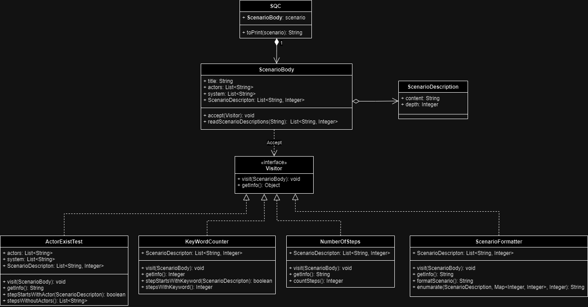

# SQC

Dla analityków dokumentujących wymagania funkcjonalne za pomocą scenariuszy nasza aplikacja SQC dostarczy informacji ilościowych oraz umożliwi wykrywanie problemów w wymaganiach funkcjonalnych zapisanych w postaci scenariuszy. Aplikacja będzie dostępna poprzez GUI a także jako zdalne API dzięki czemu można ją zintegrować z istniejącymi narzędziami.

## 🛠 Build and run

`mvn spring-boot:run`

## 🔀 UML

